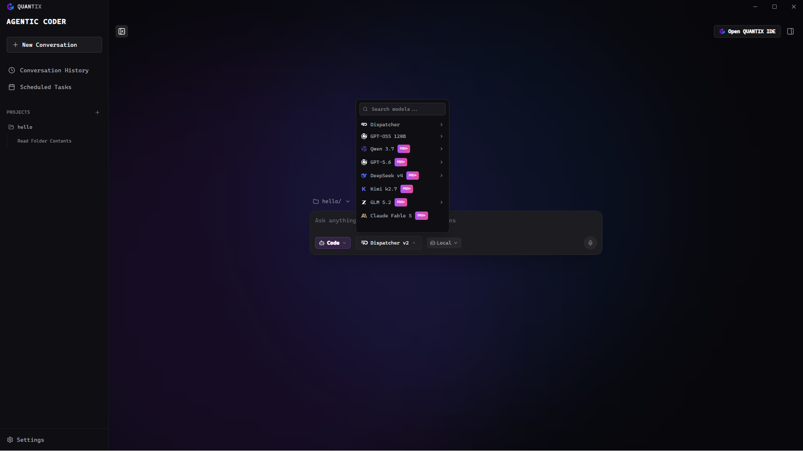
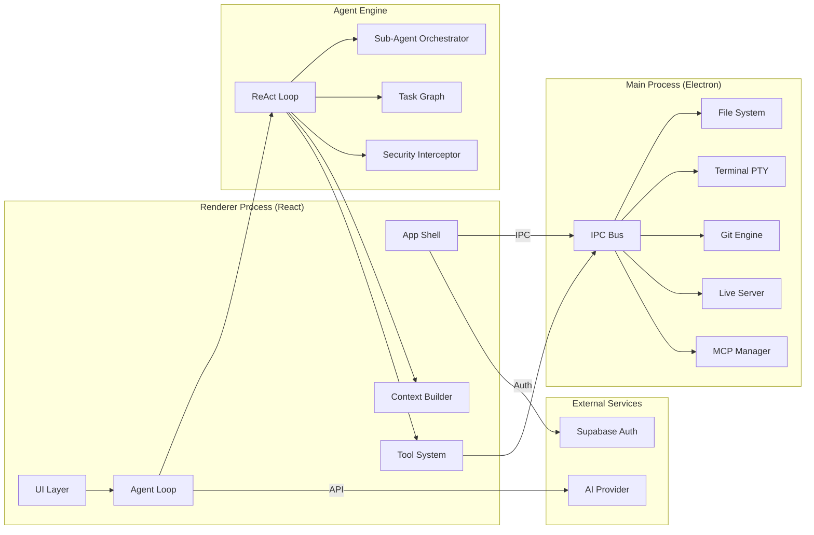
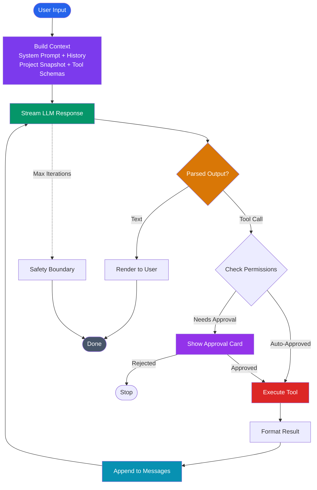
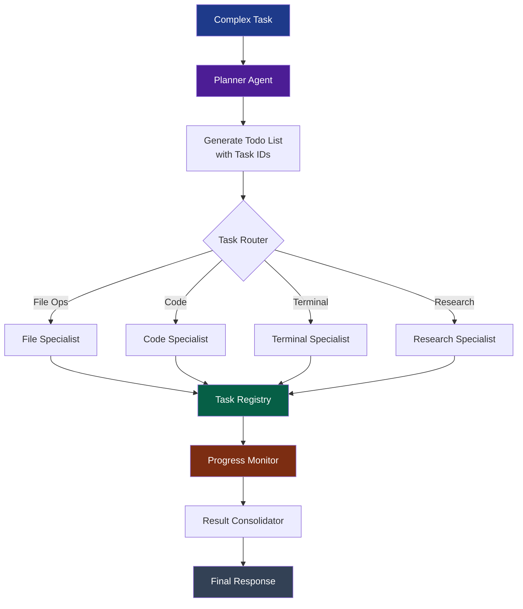
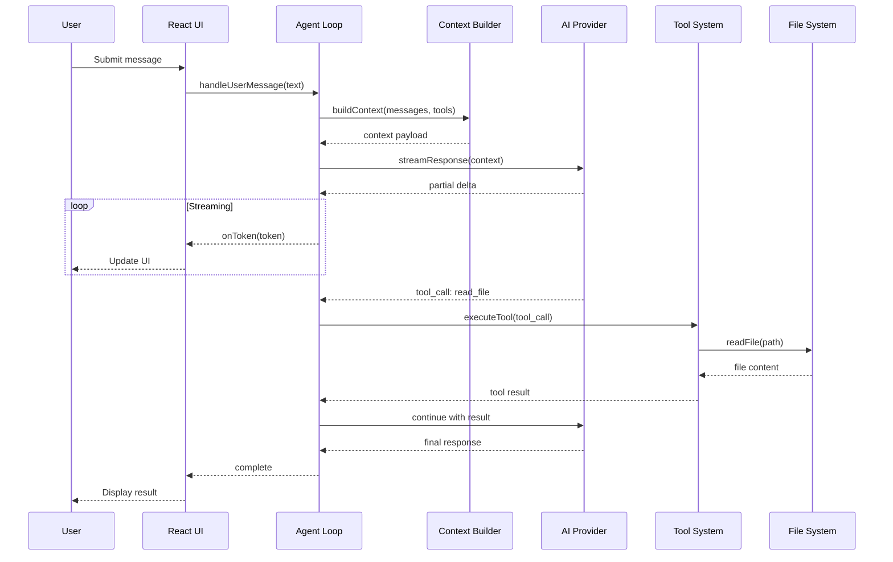
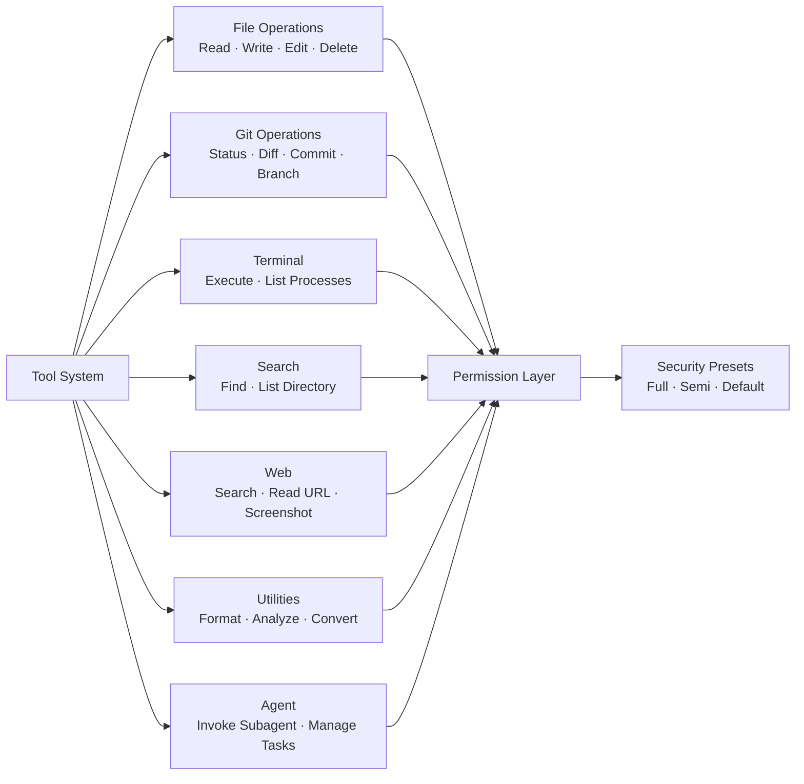
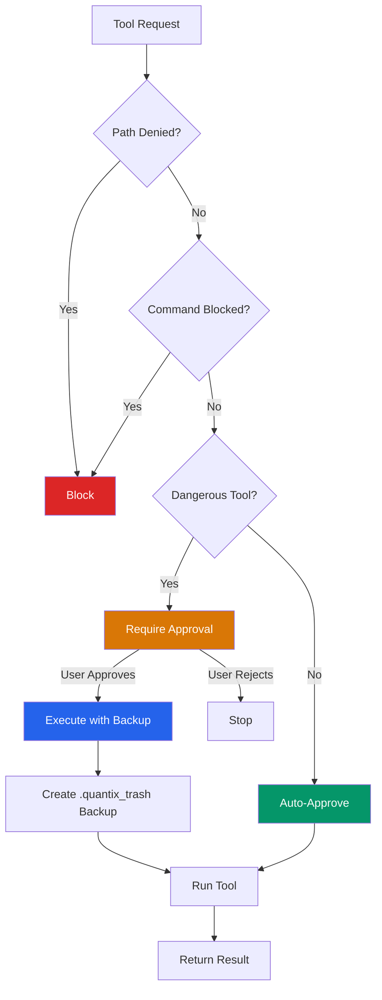

# QUANTIX CODE

<div align="center">


**AI-Powered Desktop Coding Assistant**

*Locally hosted. Agentic by default. IDE-native.*

[](#)
[](#)
[](#)
[](#)

<br/>



</div>

---

## 📖 Table of Contents
- [Overview](#-overview)
- [Features](#-features)
- [Architecture](#-architecture)
- [Model Support](#-model-support)
- [Project Structure](#-project-structure)
- [Getting Started](#-getting-started)
- [License](#-license)

---

## 🌟 Overview

**QUANTIX CODE** is a locally hosted desktop application that brings agentic AI directly into your development environment. It combines a full IDE — Monaco Editor, integrated terminal, Git, and live preview — with an autonomous agent loop that can read, write, execute, and refactor code on your behalf.

Instead of copy-pasting between a chat window and your editor, QUANTIX CODE operates inside your project, understands your codebase, and executes tasks through a controlled, permission-aware tool layer.

---

## ✨ Features

### 🤖 Agentic AI
- **ReAct-style** iterative reasoning with 7+ tool call format support.
- **Real-time streaming** with token-level UI updates.
- **Multi-model dispatcher**: Dispatcher v1/v1.2/v2, GPT-5.6 Luna/Terra/Sol, DeepSeek v4, Kimi k2.7, GLM 5.2, Qwen 3.7, Claude Fable 5, and more.
- **Sub-agent orchestration** with sleep/wakeup and sibling file manifest.
- **Task graph** with topological sorting and critical path detection.
- **Sequential thinking gate** for complex planning traces.
- **Context summarization** when approaching token limits.

### 💻 IDE Experience
- **Monaco Editor** with syntax highlighting and theme support.
- **Integrated terminal** via xterm + node-pty.
- **Git integration**: status, diff, commit, branch, checkpoints.
- **Live preview server** for web projects.
- **File explorer** with context menus and undo/redo.
- **Code validation** for TypeScript, HTML, and Python.

### 🧰 Agent Tools
Over **50+ tools** covering file operations, Git, terminal execution, web search, code intelligence, and system utilities. Tools are permission-classified by danger level and filtered per security preset.

### 🛡️ Security
- **Path-based and command-based blocking** to prevent dangerous operations.
- **Configurable approval presets** (Full / Semi / Default / User-Guided).
- **Automatic backup** before destructive operations (`.quantix_trash`).
- **Git checkpoint system** for non-destructive rollback.
- **Audit logging** in local storage.

### 🎨 UI
- **Glassmorphism design** with animated backgrounds.
- **Three-pane layout**: conversations, IDE, and activity monitor.
- **Collapsible sidebars** and a custom title bar.
- **Real-time token budget visualization**.
- **Agent activity timeline** with thinking blocks.

---

## 🏗️ Architecture

### System Overview



### Agent Reasoning Loop



### Sub-Agent Orchestration



### Data Flow



### Tool System



### Security Model



---

## 🧠 Model Support

| Model | Context | Max Tokens | Notes |
|-------|---------|------------|-------|
| Dispatcher v1 / v1.2 / v2 | 1,000,000 | 32,768 | Default dispatcher |
| GPT-5.6 Luna / Terra / Sol | 128,000 | 32,768 | Native function calling |
| DeepSeek v4 Flash / Pro | 128,000 | 32,768 | Efficient alternatives |
| Qwen 3.7 Flash / Plus / Max | — | — | Via model endpoint |
| GPT-OSS High / Medium | — | — | Open-source tier |
| Kimi k2.7 | 128,000 | 32,768 | Moonshot AI |
| GLM 5.2 / Lite | 128,000 | 32,768 | Zhipu AI |
| Claude Fable 5 | 200,000 | 32,768 | Anthropic |

---

## 📁 Project Structure

```text
src/
├── components/
│   ├── chat/                 # Chat interface
│   ├── ide/                  # IDE components
│   ├── IdeContainer.tsx      # Full IDE view
│   ├── MainContent.tsx       # Chat/IDE area
│   ├── RightSidebar.tsx      # Tasks · Activity · Files · Context
│   ├── Sidebar.tsx           # Conversations
│   └── TitleBar.tsx          # Custom window chrome
├── lib/
│   ├── agentLoop.ts          # Core agentic reasoning engine
│   ├── aiConfig.ts           # Model configuration
│   ├── contextBuilder.ts     # LLM context assembly
│   ├── tools/                # 50+ tool definitions & executor
│   ├── TaskManager.ts        # Background task management
│   ├── taskGraph.ts          # Dependency graph with topological sort
│   ├── subAgentOrchestrator.ts # Sub-agent delegation
│   ├── SecurityInterceptor.ts # Permission & safety checks
│   ├── parallelExecutor.ts   # Parallel tool execution
│   └── incrementalToolCallParser.ts # Streaming tool detection
├── App.tsx                   # Application root
├── main.ts                   # Electron main process
└── preload.ts                # IPC bridge
```

---

## 🚀 Getting Started

### Prerequisites
- [Node.js](https://nodejs.org/) v18+
- npm v9+

### Installation

1. **Clone the repository:**
   ```bash
   git clone https://github.com/tribrix23/agentic.git
   cd agentic
   ```

2. **Install dependencies:**
   ```bash
   npm install
   ```

3. **Install MCP Server dependencies:**
   ```bash
   cd agentic-mcp-server
   npm install
   cd ..
   ```

### Configuration
Create a `.env` file in the root directory and add your required configuration values (such as API keys and Supabase credentials).

### Development
Start the application in development mode:
```bash
npm start
```

### Production Build
Package the application for production:
```bash
npm run make
```

**Platform-Specific Builds:**
```bash
npm run make -- --platform=win32
npm run make -- --platform=darwin
npm run make -- --platform=linux
```

---

## 📄 License

This project is licensed under the **MIT** License.

---

<div align="center">

*Built for developers who want AI assistance without leaving their IDE.*

</div>
