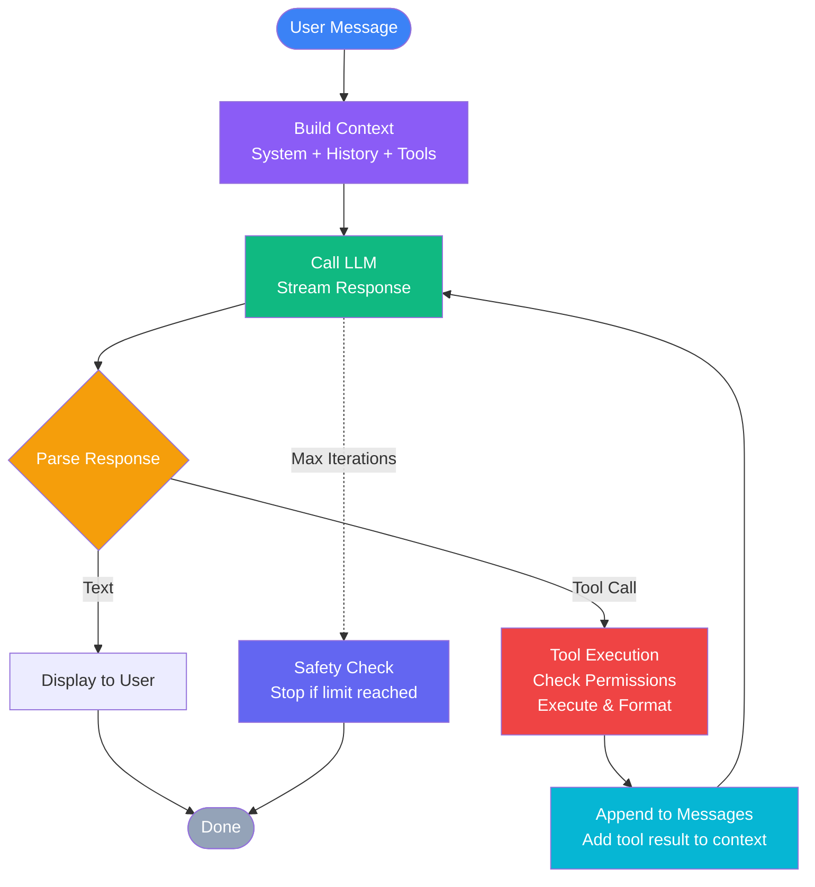

# QUANTIX CODE

<div align="center">


**AI-Powered Desktop Coding Assistant**

[](https://opensource.org/licenses/MIT)
[](https://www.electronjs.org/)
[](https://reactjs.org/)
[](https://www.typescriptlang.org/)

*A sophisticated AI pair programming environment with agentic tool execution, multi-model support, and premium IDE features.*

[Features](#-features) • [Installation](#-installation) • [Architecture](#-architecture) • [Usage](#-usage) • [Configuration](#-configuration) • [Contributing](#-contributing)

</div>

---

## 🌟 Features

### 🤖 Advanced AI Capabilities
- **Multi-Model Support**: Dispatcher v1/v1.2/v2, GPT-5.6 (Luna, Terra, Sol), DeepSeek v4, Kimi k2.7, GLM 5.2
- **Agentic Reasoning**: ReAct-style agent loop with sophisticated state management
- **Tool Calling**: Native and text-fallback tool execution with permission controls
- **Streaming Responses**: Real-time text streaming with configurable delays
- **Context Management**: Smart token budgeting with automatic summarization

### 💻 IDE Features
- **File Management**: Project navigation, file operations, and Git integration
- **Terminal Integration**: Full terminal emulation with xterm and node-pty
- **Code Editor**: Monaco Editor integration with syntax highlighting
- **Live Preview**: Built-in live server for web development
- **Git Operations**: Status, commit, diff, and branch management

### 🎨 Premium UI
- **Modern Design**: Glassmorphism effects, animated backgrounds, smooth transitions
- **Three-Pane Layout**: Conversations, chat/IDE, and activity monitoring
- **Real-time Feedback**: Agent activity tracking, file change monitoring, progress indicators
- **Responsive Interface**: Collapsible sidebars, custom title bar, splash screen

### 🔒 Security & Safety
- **Permission System**: Configurable read/write approvals
- **Security Presets**: Full, user-guided, semi, and default modes
- **Backup System**: Automatic backup before destructive operations
- **Error Recovery**: Retry logic with exponential backoff

---

## 🚀 Installation

### Prerequisites
- **Node.js**: v18.0.0 or higher
- **npm**: v9.0.0 or higher
- **Git**: For version control features

### Clone Repository
```bash
git clone https://github.com/tribrix23/agentic.git
cd agentic
```

### Install Dependencies
```bash
npm install
cd agentic-mcp-server
npm install
cd ..
```

### Environment Setup
Create a `.env` file in the root directory:
```env
VITE_SUPABASE_URL=your_supabase_url
VITE_SUPABASE_SERVICE_KEY=your_supabase_service_key
```

Note: The API key is now automatically fetched from the temporary API key endpoint, so no manual API key configuration is required.

### Development Mode
```bash
npm start
```

### Build for Production
```bash
npm run make
```

### Build Specific Platforms
```bash
# Windows
npm run make -- --platform=win32

# macOS
npm run make -- --platform=darwin

# Linux
npm run make -- --platform=linux
```

---

## 🏗️ Architecture

### System Overview

```mermaid
graph LR
    subgraph Main_Process["Main Process (Electron)"]
        A[Window Management]
        B[IPC Handlers]
        C[File System]
        D[Terminal PTY]
        E[Git Operations]
        F[Task Manager]
        G[Deep Link Auth]
    end
    
    subgraph Renderer_Process["Renderer Process (React)"]
        H[React UI]
        I[Agent Loop]
        J[Tool System]
        K[Context Builder]
        L[Chat Interface]
        M[File Explorer]
        N[Activity Monitor]
    end
    
    subgraph External_Services["External Services"]
        O[AI API]
        P[Supabase]
        Q[MCP Server]
        R[Git Repositories]
        S[File System]
    end
    
    Main_Process -->|IPC| Renderer_Process
    Renderer_Process -->|API Calls| External_Services
```



### Agent Loop Architecture



### Component Structure

```
src/
├── components/
│   ├── chat/              # Chat interface components
│   │   ├── AgentProgressCard.tsx
│   │   ├── MessageBubble.tsx
│   │   ├── PromptInput.tsx
│   │   ├── ToolApprovalCard.tsx
│   │   └── ...
│   ├── ide/               # IDE-specific components
│   ├── IdeContainer.tsx   # Full IDE view
│   ├── MainContent.tsx    # Main chat/IDE area
│   ├── RightSidebar.tsx   # Activity & tasks
│   ├── Sidebar.tsx        # Conversation list
│   └── TitleBar.tsx       # Custom window title bar
├── lib/
│   ├── agentLoop.ts       # Core agentic reasoning engine
│   ├── aiConfig.ts        # AI configuration management
│   ├── contextBuilder.ts  # Context construction for LLM
│   ├── tools/             # Tool definitions and execution
│   ├── TaskManager.ts     # Background task management
│   └── ...
├── api.ts                 # API layer for LLM communication
├── App.tsx                # Main application component
└── main.ts                # Electron main process
```

---

## 📖 Usage

### Getting Started

1. **Launch the Application**
   ```bash
   npm start
   ```

2. **Authenticate**
   - Click "Log In" to authenticate via deep link
   - The app will open `quantix.devctr.com` for authentication
   - After successful auth, you'll be redirected back to the app

3. **Select a Project**
   - Click "Open Project" in the sidebar
   - Navigate to your project directory
   - The app will detect Git branch and load project structure

### Basic Chat

**Send a Message**: Type your request in the prompt input and press Enter

**Example Prompts**:
- "Create a React component for a user profile card"
- "Debug this function - it's not returning the expected result"
- "Refactor this code to use modern JavaScript patterns"
- "Add unit tests for the authentication module"

### AI Agent Features

**Tool Execution**: The AI can automatically:
- Read and analyze files
- Write and edit code
- Run terminal commands
- Execute Git operations
- Search within files

**Sub-agent Delegation**: For complex tasks, the AI will:
1. Break down the task into smaller sub-tasks
2. Create a todo list with task IDs
3. Delegate each sub-task to specialized sub-agents
4. Monitor progress and consolidate results

**Example Complex Request**:
```
"Build a complete portfolio website with:
- Responsive design using TailwindCSS
- Dark mode toggle
- Project gallery with filtering
- Contact form with validation
- Smooth animations"
```

### IDE Features

**File Operations**:
- Double-click files to open them in Monaco Editor
- Right-click for context menu (rename, delete, show in folder)
- Drag and drop files to reorganize

**Terminal**:
- Click the terminal icon to open the integrated terminal
- Commands run in your project directory
- Supports all standard shell commands

**Git Integration**:
- View Git status in the sidebar
- Stage files with one click
- Commit with custom messages
- View diff before committing

### Configuration

**AI Settings** (Settings → AI Configuration):
- Model selection (Dispatcher, GPT-5.6, DeepSeek, etc.)
- Temperature, Top P, Top K parameters
- Max tokens and context window
- Streaming preferences
- Security presets

**Security Presets**:
- **Full**: Auto-approve all operations
- **User-guided**: Require approval for reads and writes
- **Semi**: Auto-approve reads, require write approval
- **Default**: Balanced approach

---

## 🔧 Configuration

### AI Models

Available models and their capabilities:

| Model | Context Window | Max Tokens | Tools | Streaming | Description |
|-------|---------------|------------|-------|-----------|-------------|
| Dispatcher v1 | 1,000,000 | 32,768 | ✅ | ✅ | Fast responses, large context |
| Dispatcher v1.2 | 1,000,000 | 32,768 | ✅ | ✅ | Balanced speed and capability |
| Dispatcher v2 | 1,000,000 | 32,768 | ✅ | ✅ | Most capable, largest context |
| GPT-5.6 Luna | 128,000 | 32,768 | ✅ | ✅ | GPT-5.6 Luna variant |
| GPT-5.6 Terra | 128,000 | 32,768 | ✅ | ✅ | GPT-5.6 Terra variant |
| GPT-5.6 Sol | 128,000 | 32,768 | ✅ | ✅ | GPT-5.6 Sol variant |
| GPT-OSS High | 128,000 | 32,768 | ✅ | ✅ | GPT-OSS with high capability |
| GPT-OSS Medium | 128,000 | 32,768 | ✅ | ✅ | GPT-OSS with medium capability |
| DeepSeek v4 Flash | 128,000 | 32,768 | ✅ | ✅ | Fast and efficient |
| DeepSeek v4 Pro | 128,000 | 32,768 | ✅ | ✅ | Most capable DeepSeek |
| Qwen 3.7 Flash | 128,000 | 32,768 | ✅ | ✅ | Fast Qwen variant |
| Qwen 3.7 Plus | 128,000 | 32,768 | ✅ | ✅ | Enhanced Qwen capabilities |
| Qwen 3.7 Max | 128,000 | 32,768 | ✅ | ✅ | Maximum Qwen performance |
| Kimi k2.7 | 128,000 | 32,768 | ✅ | ✅ | Moonshot AI model |
| GLM 5.2 | 128,000 | 32,768 | ✅ | ✅ | Zhipu AI model |
| GLM 5.2 Lite | 128,000 | 32,768 | ✅ | ✅ | Lightweight GLM variant |
| Claude Fable 5 | 200,000 | 32,768 | ✅ | ✅ | Anthropic Claude Fable 5 |

## 📸 Screenshots


### Advanced Configuration

**Custom System Prompt**:
```typescript
// In Settings → AI Configuration
const customPrompt = `You are a specialized expert in [your domain].
Focus on [specific goals].
Use [specific frameworks/patterns].`;
```

**Tool Permissions**:
```typescript
// Configure in aiConfig.ts
const config = {
  autoApproveReads: true,
  autoApproveWrites: false,
  requireApprovalForTerminal: true,
  securityPreset: 'semi'
};
```

---

## 🛠️ Development

### Project Structure

**Main Process** (`src/main.ts`):
- Electron main process entry point
- IPC handlers for file system, terminal, Git
- Window management and deep link handling

**Renderer Process** (`src/App.tsx`):
- React application root
- State management for UI components
- Event handling for agent activities

**Agent Loop** (`src/lib/agentLoop.ts`):
- Core agentic reasoning engine
- Tool execution and permission handling
- Context management and summarization

**Tool System** (`src/lib/tools/`):
- File system tools
- Terminal tools
- Git tools
- Custom tool definitions

### Adding Custom Tools

1. **Define Tool Schema**:
```typescript
// src/lib/tools/definitions/myTool.ts
export const myToolDefinition = {
  name: 'myTool',
  description: 'Description of what the tool does',
  parameters: {
    type: 'object',
    properties: {
      param1: { type: 'string', description: 'Parameter description' }
    },
    required: ['param1']
  }
};
```

2. **Implement Tool Handler**:
```typescript
// src/lib/tools/executor.ts
export async function executeMyTool(params: any) {
  // Tool implementation
  return { success: true, data: 'result' };
}
```

3. **Register Tool**:
```typescript
// src/lib/tools/index.ts
export const toolRegistry = {
  myTool: {
    definition: myToolDefinition,
    executor: executeMyTool
  }
};
```

### Testing

```bash
# Run unit tests
npm test

# Run integration tests
npm run test:integration

# Run with coverage
npm run test:coverage
```

### Building

```bash
# Development build
npm run build

# Production build
npm run make

# Platform-specific builds
npm run make -- --platform=win32 --arch=x64
npm run make -- --platform=darwin --arch=x64
npm run make -- --platform=linux --arch=x64
```

---

## 🤝 Contributing

We welcome contributions! Please follow these guidelines:

1. **Fork the repository**
2. **Create a feature branch**: `git checkout -b feature/amazing-feature`
3. **Commit your changes**: `git commit -m 'Add amazing feature'`
4. **Push to the branch**: `git push origin feature/amazing-feature`
5. **Open a Pull Request**

### Code Style

- Use TypeScript for all new code
- Follow existing code formatting
- Add comments for complex logic
- Update documentation as needed

### Commit Messages

Use conventional commits:
- `feat: Add new feature`
- `fix: Fix bug`
- `docs: Update documentation`
- `refactor: Refactor code`
- `test: Add tests`

---

## 📄 License

This project is licensed under the MIT License - see the LICENSE file for details.

---

## 🙏 Acknowledgments

- **Electron Team** - For the amazing desktop framework
- **React Community** - For the excellent UI library
- **Monaco Editor** - For the powerful code editor
- **Supabase** - For the backend services
- **AI Providers** - For the powerful language models

---

## 📞 Support

- **Issues**: [GitHub Issues](https://github.com/tribrix23/agentic/issues)
- **Discussions**: [GitHub Discussions](https://github.com/tribrix23/agentic/discussions)
- **Email**: tribrix23@gmail.com

---

## 🗺️ Roadmap

### Upcoming Features

- [ ] Multi-language support
- [ ] Collaborative editing
- [ ] Advanced debugging tools
- [ ] Plugin system
- [ ] Cloud sync for conversations
- [ ] Mobile companion app
- [ ] Voice input/output
- [ ] Advanced code analysis
- [ ] Performance profiling
- [ ] Custom theme editor

### Version History

**v1.0.0** (Current)
- Initial release
- Multi-model AI support
- Agentic tool execution
- IDE features
- Terminal integration
- Git operations
- Premium UI

---

<div align="center">

**Built with ❤️ by [John David L. Perez](https://github.com/tribrix23)**

[⬆ Back to Top](#quantix-code)

</div>
